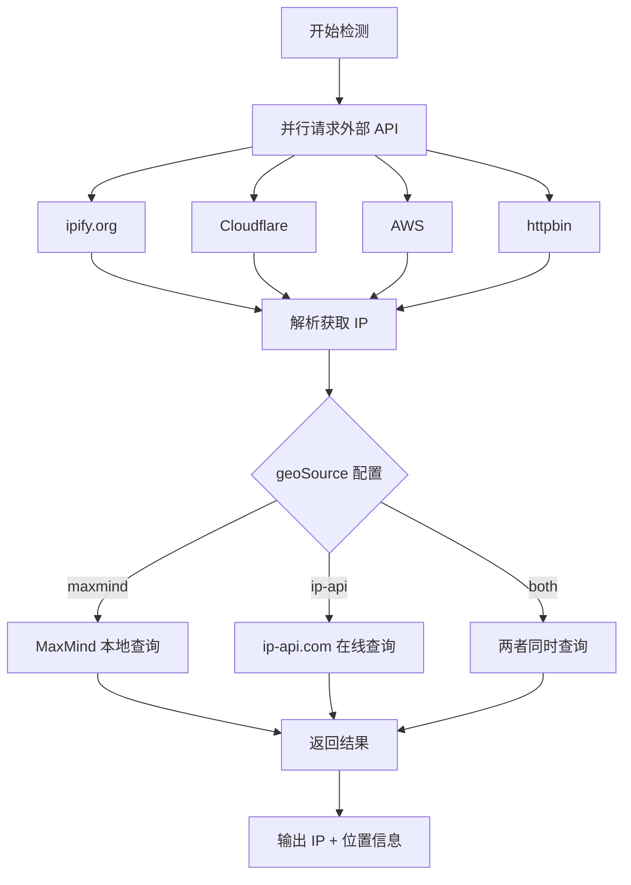

# IP Detector

极简 IP 检测工具，检测公网 IP 并查询地理位置。

## 工作流程



## 快速开始

```bash
npm install
npm run cli
```

## 项目结构

```
src/
├── index.ts       # CLI 入口
├── server.ts      # Web 服务器
├── config.ts      # 配置
├── detector.ts    # IP 检测
├── geolocation.ts # 地理定位（MaxMind + API 备用）
└── types.ts       # 类型定义
```

## 配置

创建 `config.js` 覆盖默认配置：

```javascript
module.exports = {
  timeout: 10000,
  maxmindPath: './data/GeoLite2-City.mmdb',
  geoSource: 'both',       // 'maxmind' | 'ip-api' | 'both'
  reverseGeocode: false,   // 无城市时用坐标反查
  targets: [
    { name: '名称', url: 'https://api.ipify.org?format=json', parser: 'json', path: 'ip' },
    { name: '名称', url: 'https://icanhazip.com', parser: 'text', regex: '([\\d.]+)' }
  ]
};
```

**geoSource 选项：**
- `maxmind` - 仅使用本地 MaxMind 数据库
- `ip-api` - 仅使用 ip-api.com 在线查询
- `both` - 同时查询两个源（默认）

**reverseGeocode 选项：**
- `true` - 当 MaxMind 无城市数据时，通过经纬度反查城市（使用 Nominatim）
- `false` - 关闭逆地理编码（默认）

## 命令

```bash
npm run cli          # 运行 CLI
npm run server       # 运行 Web 服务器
npm run build        # 构建
```

## API

| 端点 | 说明 |
|------|------|
| `GET /api/health` | 健康检查 |
| `GET /api/detect` | 检测所有目标 |
| `GET /api/locate/:ip` | IP 地理定位 |

## GeoIP 数据库

1. 注册 MaxMind：https://www.maxmind.com/en/geolite2/signup
2. 下载 GeoLite2-City 数据库（mmdb 格式）
3. 放置到 `data/GeoLite2-City.mmdb`

如无本地数据库，将自动使用在线 API 备用。

## TODO

- [ ] 支持通过 CLI 参数配置是否展示具体城市
- [ ] 支持通过 CLI 参数配置 geoSource
